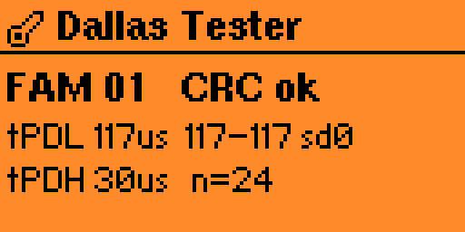

# Dallas Tester

[](https://github.com/mishamyte/flipper-dallas-tester/actions/workflows/build.yml)

A Flipper Zero app (Unleashed, `applications_user`) that measures the **1-Wire presence-detect
low time (tPDL)** of iButton / Dallas keys and blanks (DS1990A, RW1990, TM1990 …) and shows the
**family code (FAM)** — a read-only "Test Dallas" bench meter.

## Why tPDL

Strict intercoms (e.g. Vizit) reject keys whose presence pulse is too short. A genuine DS1990A
holds the bus low ~100-160 µs (datasheet window 60-240 µs); weak clones often come in lower.
Measuring tPDL before cloning lets you cull blanks a picky reader would refuse.

## Reading the screen

When a key is on the contacts, the **Test** screen shows:



| Field | Meaning |
|-------|---------|
| **FAM** | 1-Wire family code (ROM byte 0). `01` = DS1990 line key. |
| **CRC ok / bad** | Whether the 8-byte ROM read back with a valid Maxim CRC8. `bad` = no key at read time, or a garbled read. |
| **tPDL `N`us** | Presence-detect low time, **median** of the batch — how long the slave holds the bus low after a reset. ~100-160 µs is healthy; short pulses (~80-90 µs) get rejected by strict intercoms. |
| **`lo`-`hi`** | min-max of tPDL across the batch. |
| **sd`N`** | jitter — population standard deviation of tPDL, in µs. A steady key reads `sd0`-`sd2`. |
| **tPDH `N`us** | Presence-detect high time (median) — delay from the master releasing the bus to the slave pulling it low. |
| **n=`N`** | valid presence pulses captured this batch (out of 24). |

A green LED blinks once when a key is detected. No key → an "Apply key" prompt; a shorted /
stuck bus → "Bus low / Check contacts".

## How it works

`dallas_test_worker.c` bit-bangs a 1-Wire reset on the iButton pin (PB14, open-drain) and times
the presence pulse with the **DWT cycle counter** (15.6 ns/tick @ 64 MHz) inside a critical
section, so RTOS/USB/BLE interrupts can't stretch a reading — the same technique the firmware's
own 1-Wire *slave* driver uses. Each batch runs 24 resets, drops glitches, takes the median,
then does a Read ROM (`0x33`) for FAM/CRC. Everything is **read-only** — the app never writes to
a key.

## Power & the 5V pin

1-Wire is an open-drain bus: the master only ever pulls the line low and lets a pull-up restore
it high. Empirically those reads only work while the Flipper's switchable **5V pin** is powered —
the bus pull-up appears to be fed from it (it's also why the stock iButton app enables 5V to
read). With the rail off, every released reset reads as a stuck-low bus and the screen shows
**Bus low / Check contacts**.

So the Test screen **powers the 5V (OTG) rail while a test is running and restores it on exit**,
mirroring what the stock iButton app does. Nothing to configure; just note that:

- the **5V GPIO pin is powered while a test is running** (relevant if you wired an external
  pull-up — or anything else — to it);
- if you had *5V on GPIO* enabled globally, the app leaves it on — it only switches 5V back off
  if it was the one that turned it on; and
- on **USB power** the charger may defer the boost, so 5V (and thus a clean read) isn't
  guaranteed while plugged in.

## A note on "original vs clone"

This tool deliberately does **not** claim an Original-Dallas / clone verdict. On the Flipper's
read-only 1-Wire interface a good clone (RW1990 / TM1990) that answers legacy Read ROM `0x0F`,
times in the genuine band, and exposes no rewritable-flag register is **indistinguishable from a
genuine DS1990A** (verified on real keys). Telling them apart needs a write probe that engages
the RW program protocol — which a bench duplicator does but a non-destructive tester shouldn't.
So tPDL / FAM are reported as measured facts; authenticity is left to the user.

## Menu

- **Test** — apply a key to the contacts; live tPDL / tPDH / FAM readout.
- **About** — app description and author.

## Build

Targets **Unleashed** firmware. In-tree (drop this folder into an Unleashed checkout under
`applications_user/`):

```sh
./fbt fap_dallas_tester                                # build the .fap
./fbt launch APPSRC=applications_user/dallas_tester    # build + deploy + run over USB
```

Standalone with [ufbt](https://github.com/flipperdevices/flipperzero-ufbt) pointed at an
Unleashed SDK: `ufbt` / `ufbt launch` from this folder. CI (`.github/workflows/build.yml`)
builds the FAP against the Unleashed SDK on every push and uploads the `.fap` as an artifact.

## License

GPL-3.0 — see [LICENSE](LICENSE).
